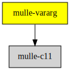

# mulle-vararg

#### ⏪ Access variable arguments in struct layout fashion in C

A variable argument passing scheme written in C (C11). It's an alternative
to
[stdarg](//en.wikipedia.org/wiki/Stdarg.h) or
[varargs](//pubs.opengroup.org/onlinepubs/7908799/xsh/varargs.h.html),
but not compatible with either.


| Release Version                                       | Release Notes  | AI Documentation
|-------------------------------------------------------|----------------|---------------
|  [](//github.com/mulle-c/mulle-vararg/actions) | [RELEASENOTES](RELEASENOTES.md) | [DeepWiki for mulle-vararg](https://deepwiki.com/mulle-c/mulle-vararg)


## API

There is an API to access mulle-vararg arguments. You can also build up
a mulle-vararg manually with the builder functions.

* [Vararg](dox/API_VARARG.md)
* [VarargBuilder](dox/API_VARARG_BUILDER.md)


## How it works

**mulle-vararg** assumes that the arguments are not layed out in stack
alignment fashion but like in a struct. The C promotion rules are still
observed though.

> Remember the C argument promotion rules are
>
> 1. char and short to int/unsigned int
> 2. float to double
>

Let's assume there is a compiler that uses **mulle-vararg** for variable
arguments. It collects **all** function parameters and packs them into a struct,
then passes this struct to the function.

A **printf** function being being called like this:

``` c
printf( "%d %f %lld\n", (char) 'x', (float) 0.2, 1848LL;
```

would get its arguments embedded in a struct like this

``` c
struct
{
   char    *format;
   struct
   {
      int         value1;     // standard char -> int promotion
      double      value2;     // standard float -> double promotion
      long long   value3;
   } varargs;
} _param;
```

**mulle-vararg** provides the necessary functions to read such a struct. It has
some experimental code to write to it.

#### Advantages

* Easy to write in C, does not need compiler ABI internals to construct or
read. You don't need [libffi](//sourceware.org/libffi/) or some such.
* Cheap forwarding to other functions.

#### Disadvantages

* Not compatible with `<stdarg.h>`

### You are here




## Add

**This project is a component of the [mulle-core](//github.com/mulle-core/mulle-core) library. As such you usually will *not* add or install it
individually, unless you specifically do not want to link against
`mulle-core`.**


### Add as an individual component

Use [mulle-sde](//github.com/mulle-sde) to add mulle-vararg to your project:

``` sh
mulle-sde add github:mulle-c/mulle-vararg
```

To only add the sources of mulle-vararg with dependency
sources use [clib](https://github.com/clibs/clib):


``` sh
clib install --out src/mulle-c mulle-c/mulle-vararg
```

Add `-isystem src/mulle-c` to your `CFLAGS` and compile all the sources that were downloaded with your project.


## Install

Use [mulle-sde](//github.com/mulle-sde) to build and install mulle-vararg and all dependencies:

``` sh
mulle-sde install --prefix /usr/local \
   https://github.com/mulle-c/mulle-vararg/archive/latest.tar.gz
```

### Legacy Installation

Install the requirements:

| Requirements                                 | Description
|----------------------------------------------|-----------------------
| [mulle-c11](https://github.com/mulle-c/mulle-c11)             | 🔀 Cross-platform C compiler glue (and some cpp conveniences)

Download the latest [tar](https://github.com/mulle-c/mulle-vararg/archive/refs/tags/latest.tar.gz) or [zip](https://github.com/mulle-c/mulle-vararg/archive/refs/tags/latest.zip) archive and unpack it.

Install **mulle-vararg** into `/usr/local` with [cmake](https://cmake.org):

``` sh
PREFIX_DIR="/usr/local"
cmake -B build                               \
      -DMULLE_SDK_PATH="${PREFIX_DIR}"       \
      -DCMAKE_INSTALL_PREFIX="${PREFIX_DIR}" \
      -DCMAKE_PREFIX_PATH="${PREFIX_DIR}"    \
      -DCMAKE_BUILD_TYPE=Release &&
cmake --build build --config Release &&
cmake --install build --config Release
```


## Author

[Nat!](https://mulle-kybernetik.com/weblog) for Mulle kybernetiK  


