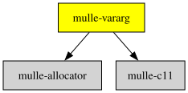

# mulle-vararg

#### ⏪ Access variable arguments in struct layout fashion in C

A variable argument passing scheme written in C (C11). It's an alternative
to
[stdarg](//en.wikipedia.org/wiki/Stdarg.h) or
[varargs](//pubs.opengroup.org/onlinepubs/7908799/xsh/varargs.h.html),
but not compatible with either.


| Release Version                                       | Release Notes  | AI Documentation
|-------------------------------------------------------|----------------|---------------
|  [](//github.com/mulle-c/mulle-vararg/actions) | [RELEASENOTES](RELEASENOTES.md) | [DeepWiki for mulle-vararg](https://deepwiki.com/mulle-c/mulle-vararg)


## API

There is an API to access mulle-vararg arguments. You can also build up
a mulle-vararg manually with the builder functions.

* [Vararg](dox/API_VARARG.md)
* [VarargBuilder](dox/API_VARARG_BUILDER.md)


## Documentation & Guides

* [API Summary](asset/dox/api/toc)


## How it works

**mulle-vararg** assumes that the arguments are not layed out in stack
alignment fashion but like in a struct. The C promotion rules are still
observed though.

> Remember the C argument promotion rules are
>
> 1. char and short to int/unsigned int
> 2. float to double
>

Let's assume there is a compiler that uses **mulle-vararg** for variable
arguments. It collects **all** function parameters and packs them into a struct,
then passes this struct to the function.

A **printf** function being being called like this:

``` c
printf( "%d %f %lld\n", (char) 'x', (float) 0.2, 1848LL;
```

would get its arguments embedded in a struct like this

``` c
struct
{
   char    *format;
   struct
   {
      int         value1;     // standard char -> int promotion
      double      value2;     // standard float -> double promotion
      long long   value3;
   } varargs;
} _param;
```

**mulle-vararg** provides the necessary functions to read such a struct. It has
some experimental code to write to it.

#### Advantages

* Easy to write in C, does not need compiler ABI internals to construct or
read. You don't need [libffi](//sourceware.org/libffi/) or some such.
* Cheap forwarding to other functions.

#### Disadvantages

* Not compatible with `<stdarg.h>`

### You are here




## Add

mulle-vararg is a component of the [mulle-core](//github.com/mulle-core/mulle-core) library. So in your code include the mulle-core umbrella header:

``` c
#include <mulle-core/mulle-core.h>
```

### Add mulle-core to a cmake and git project

``` bash
git submodule add https://github.com/mulle-core/mulle-core.git mulle-core
```

Add this to your `CMakeLists.txt`:

``` cmake
add_subdirectory( mulle-core)
target_link_libraries( ${PROJECT_NAME} PRIVATE mulle-core)
```


### Add mulle-core to a mulle-sde project

``` sh
mulle-sde add github:mulle-core/mulle-core
```

### Embed mulle-vararg with clib

``` sh
clib install --out src mulle-c/mulle-vararg
```

Append `src` to your include path (e.g. add `-isystem src`  to your `CFLAGS`)
and compile all the sources that were downloaded.


## Author

[Nat!](https://mulle-kybernetik.com/weblog) for Mulle kybernetiK  


